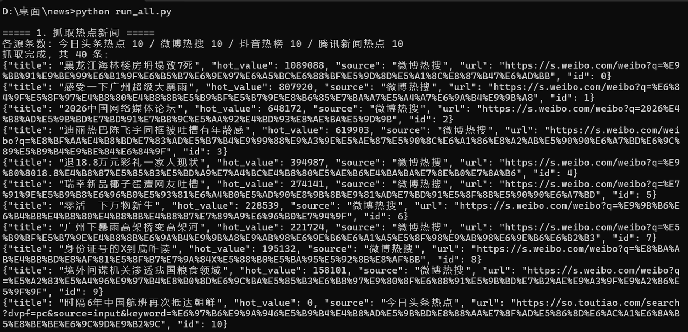
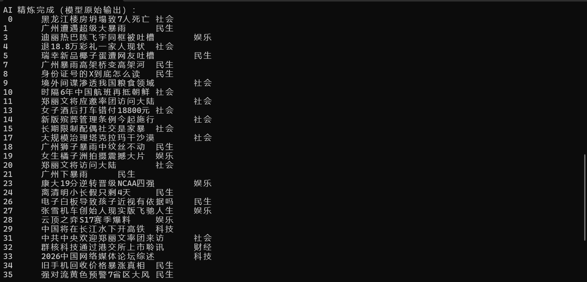
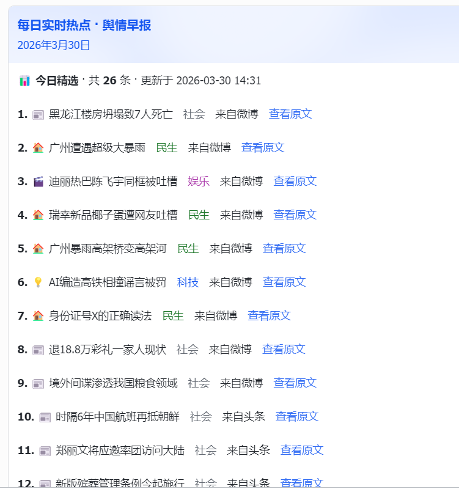
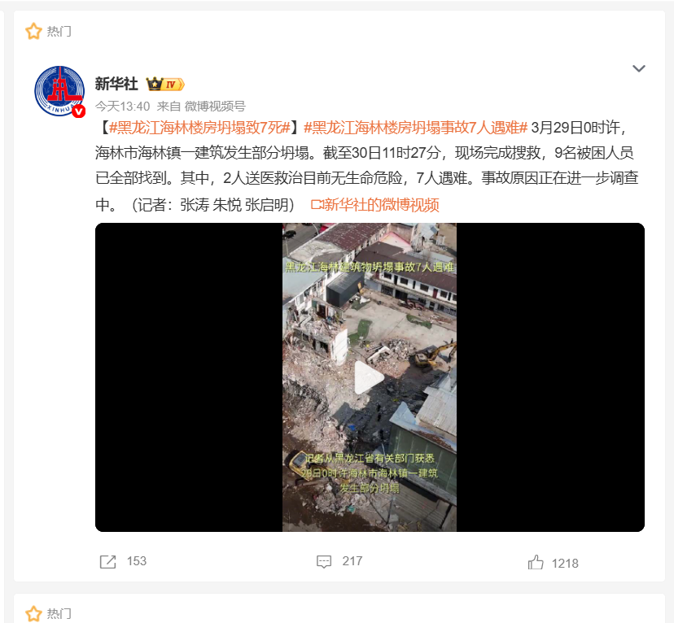
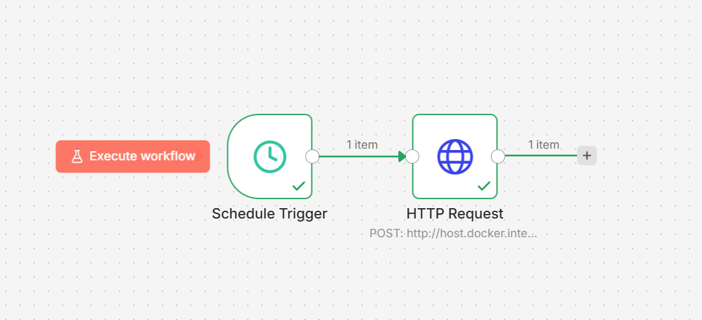

<p align="center">
  <h1>📰 AI 热点新闻 · 智能推送</h1>
  <p><strong>热点抓取 + DeepSeek AI 摘要 + 飞书机器人推送 + n8n 定时自动化</strong></p>
</p>

---

## 📖 项目简介

自动化新闻工作流：爬取当日热点新闻 → DeepSeek AI 智能摘要/分类/过滤 → 飞书群机器人推送，全程由 n8n 定时触发，无需人工干预。

> 每天早上 8:00 自动获取最新热点 + AI 精选 TOP5 + 摘要，推送到飞书群。

---

## 📸 项目截图

<p align="center">
  
</p>

<p align="center">
  
  
</p>

<p align="center">
  
  
</p>

---

## 🔄 工作流程

```
n8n 定时触发 (每日 8:00)
        │
        ▼
host_trigger.py (HTTP 服务)
        │
        ▼
┌───────────────────────┐
│  1. news_spider.py    │  ← 抓取热点新闻 → hot_news.json
│  2. ai_news_filter.py │  ← DeepSeek 摘要/分类/过滤
│  3. send_to_feishu.py │  ← 飞书机器人推送到群
└───────────────────────┘
```

---

## 🛠 技术栈

| 层级 | 技术 |
|------|------|
| 语言 | Python 3 |
| AI 模型 | DeepSeek API（摘要/过滤/分类） |
| 通知推送 | 飞书群自定义机器人 Webhook |
| 定时调度 | n8n Cron 工作流 |
| HTTP 触发 | Python 自建 HTTP 服务（host_trigger） |
| 数据格式 | JSON（中间存储） |

---

## ⚡ 快速开始

### 环境要求

- Python 3.8+
- Docker（运行 n8n）
- DeepSeek API Key
- 飞书群机器人 Webhook

### 1. 安装依赖

```bash
pip install requests
```

### 2. 配置环境变量

```bash
cp .env.example .env
```

编辑 `.env`，填入：

| 环境变量 | 说明 | 必填 |
|----------|------|------|
| `DEEPSEEK_API_KEY` | DeepSeek API 密钥 | ✅ |
| `FEISHU_WEBHOOK` | 飞书机器人 Webhook URL | ✅ |
| `FEISHU_USE_TEXT` | 用纯文本推送（默认交互卡片） | ❌ |
| `WEIBO_COOKIE` | 微博 Cookie（403 时使用） | ❌ |
| `N8N_TRIGGER_KEY` | n8n 鉴权密钥 | ❌ |
| `HOST_TRIGGER_PORT` | 宿主机监听端口（默认 8765） | ❌ |

### 3. 手动测试

```bash
python run_all.py
```

### 4. 启动 HTTP 触发服务

```bash
python host_trigger.py
# 监听 http://127.0.0.1:8765/run
```

### 5. 配置 n8n 定时工作流

1. 新建工作流 → 添加 Schedule Trigger（Cron: `0 8 * * *`）
2. 添加 HTTP Request 节点 → POST `http://host.docker.internal:8765/run`
3. 启用工作流 → 每天 8:00 自动执行

---

## 📁 项目结构

```
news/
├── news_spider.py              # 爬取热点新闻（微博/头条等）
├── ai_news_filter.py           # DeepSeek AI 摘要/分类/过滤
├── send_to_feishu.py           # 飞书机器人推送
├── run_all.py                  # 一键执行全流程
├── host_trigger.py             # HTTP 服务（供 n8n 调用）
├── daily_trigger_8am.py        # 每日定时触发脚本
├── .env.example                # 环境变量模板
├── requirements.txt            # Python 依赖
├── docs/screenshots/           # 项目截图
└── n8n-workflow-hot-news.json  # n8n 工作流导出
```

---

## License

本项目仅用于学习交流。
